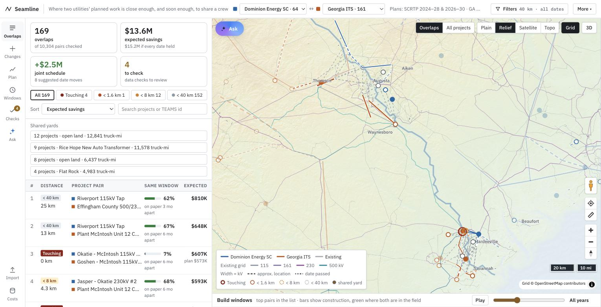
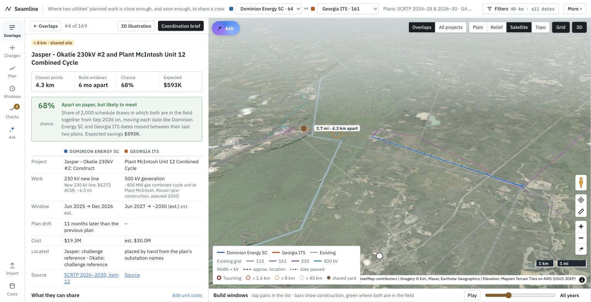
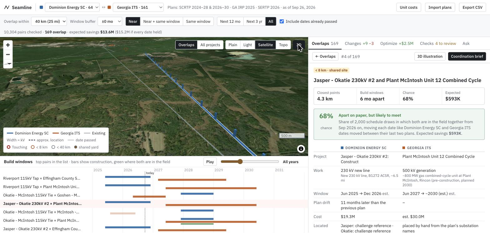
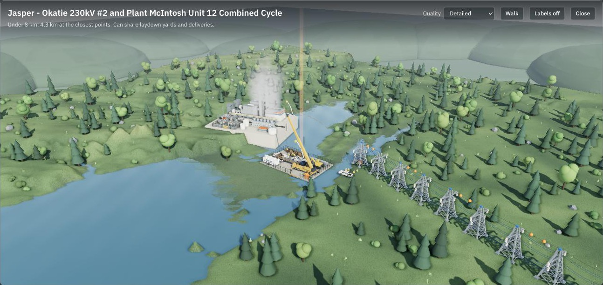
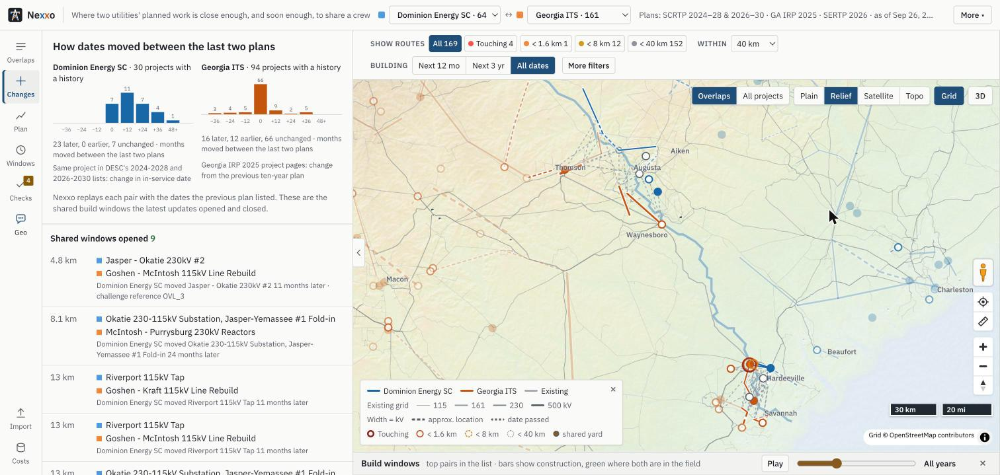
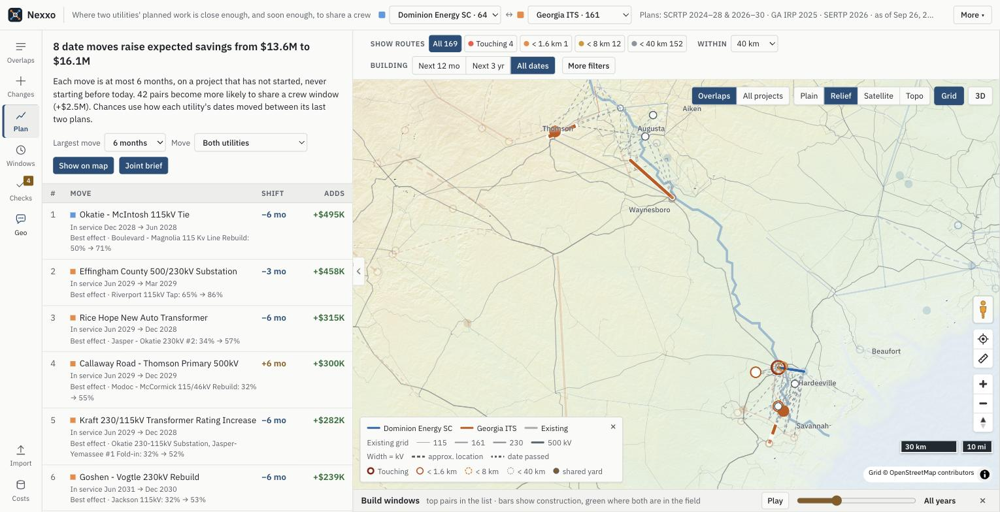
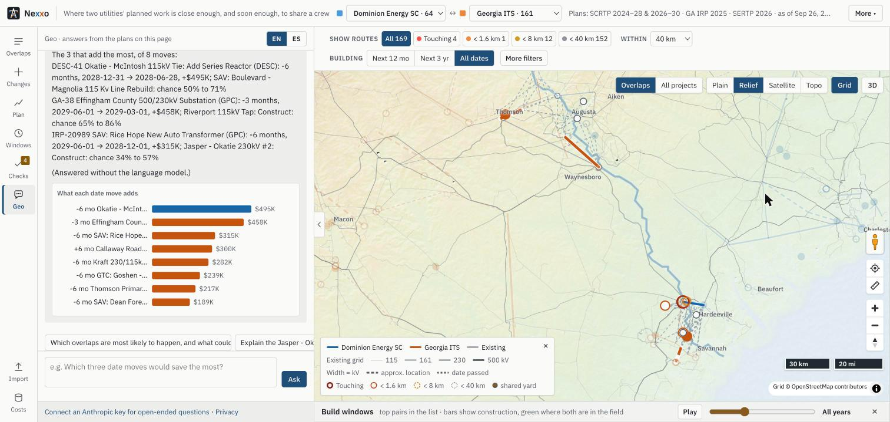

# Seamline

Seamline compares the planned transmission construction of two neighboring utilities, flags where their work overlaps (within 40 km, measured between the closest points), and tells planners which of those overlaps are **likely to really happen**, what coordinating them would save, and which few date moves would save the most.

The built-in example is **Dominion Energy South Carolina** against **Georgia** (Georgia Power, Georgia Transmission and MEAG) along the Savannah River, built from the challenge's own PDFs plus the newer published lists. Any other utility's plan can be loaded from the files utilities publish (Excel, CSV, KML/KMZ, shapefile, GeoJSON, GPX).



## What makes it different

1. **It reads the plans itself.** A reproducible pipeline extracts all 44 DESC and 218 Georgia projects from the challenge PDFs, including each Georgia project's detail page (published start date, description, miles), places every end point on OpenStreetMap substations, and runs 10 validation checks on every rebuild. Every number traces back to a PDF page, a TEAMS number and how its location was found. It reproduces **all 6** overlaps in the challenge's reference table.
2. **It knows plans move.** Comparing two editions of each utility's plan shows 23 of 30 DESC projects slipped (median 12 months). Seamline turns that into a **chance** that each pair is really in the field together, from today on, and ranks pairs by **expected savings**. Of the 41 pairs that overlap on paper, 23 are less than 50% likely to still overlap; 13 pairs that don't overlap on paper are 50% or more likely to. The last plan updates opened 9 shared windows and closed 3.
3. **It says what to do.** A schedule optimizer finds the 8 date moves (at most 6 months, projects not yet started) that raise expected savings from $13.6M to $16.1M, and prints a joint proposal for both utilities.
4. **It shows the real place.** The map tilts into 3D over real terrain and satellite imagery, with towers along each planned line, across the river that separates the two states.
5. **You can ask it.** Geo, the built-in assistant, answers plain-language questions, in English or Spanish, from the same data, flies the map to what it's talking about and opens the printable briefs. The common questions work with no API key.



## Quick start

Open `index.html` in a browser, or serve the folder:

```
npm start            # python3 -m http.server 8000, then open http://localhost:8000
```

The Plain map and everything except the imagery, the 3D terrain and open-ended assistant questions work offline. The existing-grid layer is a separate file the page fetches, so it shows when the folder is served (`npm start`, GitHub Pages), not when `index.html` is opened straight from disk. The imagery and the terrain need an internet connection; open-ended questions to the assistant also need an Anthropic API key (see Geo below). The common questions are answered without one.

## The screen

One screen, laid out like the coordination tools planners already use (Esri Capital Project Coordination, one.network): a map, the ranked overlaps beside it, and the build windows underneath, all linked. A labeled rail on the left switches the panel between Overlaps (which opens with four headline numbers: overlaps, expected savings, the joint-schedule gain and checks to review, plus distance chips that choose which routes the map draws: it opens on the closest band, and each chip pressed adds its routes), Changes, Plan, Checks and Geo, and unfolds the build-windows chart under the map; Import and Unit costs sit at the bottom of the rail. A filter bar over the map keeps the distance chips, the distance limit and the build period in view, with More filters for the rest; Share and Export CSV sit under More. A tab on the side panel's edge hides it, leaving the rail and the map, and double-clicking a route brings it back on that route's pair.

- **Map** (MapLibre GL): Plain (offline), Relief (colour by elevation under a hillshade, drawn from the elevation tiles), Satellite and Topo basemaps. **3D** tilts the map over real terrain (Terrarium elevation tiles from USGS 3DEP data, exaggerated 3× since the Southeast is low), adds hillshading and a sky, and raises a tower every ~450 m along each planned line. **Grid** draws today's transmission lines (10,092 lines of 115 kV and up in Georgia and South Carolina, from OpenStreetMap) underneath, coloured by voltage. Line width is voltage, dashed is an approximate location, faded is a date that has passed, rings mark how close a pair is, dots mark shared staging yards. Bottom-right controls work like a web map: recenter, a click-to-measure ruler (each leg and the total in miles and km), zoom and compass, and scale bars in miles and km. Each listed pair's link is labeled with its gap (the open pair always, all of them from zoom 9).
- **Drop-in walker**: drag the orange figure onto any project, like Google Maps' Street View figure. The 3D illustration of that project's most valuable pair opens at ground level where it landed; walk with W A S D or the arrow keys, move the mouse to look around (click the view first; Esc frees the mouse), hold Shift to run, or switch back to the overview, where dragging flies over the scene like a drone, right-drag turns and the wheel climbs or descends. The walker follows the ground and slides around structures, trees, water and bluffs too steep to climb.
- **Overlaps**: ranked by expected savings (or chance, or distance). Each row shows the distance tier, the chance of a shared window with what the plan says, and the expected savings next to the savings if the dates held. Filters for distance tier, build period (next 12 months, next 3 years), dates already passed and a text search; shared-yard groups sit above the list; Export CSV downloads it.
- **Pair panel**: both projects side by side (work, window, plan drift, cost, how each end point was located, source page), the chance and why, each item they can share with its saving and math, the best shared yard, a schedule what-if, a coordination status saved on the device, a printable one-page brief (its locator map is an Esri topographic sheet fetched at twice print resolution, with both routes, the closest points, a legend, a km and mile scale bar and a north arrow, over plain state outlines that show when the tiles can't load), and a three.js 3D illustration of the pair.
- **Changes**: how far each utility's dates moved between its last two plans, and which shared windows the latest updates opened or closed, and why.
- **Optimize**: the date moves that most raise expected savings, with limits you set, shown on the map and printable as a joint schedule proposal.
- **Checks**: the pipeline's validation report, each check with the records it caught, downloadable as JSON.
- **Geo** (in the rail): the assistant, which greets you with "Hey, I'm Geo", for questions like "which overlaps near Augusta are most likely to happen?", "why isn't DESC-11 paired with IRP-20277?" or "¿qué cambió en el plan de DESC?". It runs Claude (`claude-opus-5`, with server-side fallbacks) through the Anthropic TypeScript SDK in the browser, with fourteen tools over Seamline's own data: search and rank projects, list and explain overlaps, compare two projects, say why a pair is *not* flagged, plan changes, the schedule optimizer and the data checks, plus four that act on the page (show something on the map, open a pair's coordination brief, the joint schedule proposal or a report over the whole comparison). `src/agent.js` runs the loop; the tools are in `src/app.js`. The site has no server, so each viewer pastes their own Anthropic API key; it stays in that browser and is sent only to Anthropic's API. **Without a key**, or when the API can't be reached, `src/agent-offline.js` routes the common questions (every capability the panel lists) straight to the same tools by pattern and says so in the answer; anything it can't place with confidence asks for a key instead of guessing. Pairs just past the distance screen are listed under the ranking, kept out of every total, so the 40 km line reads as a chosen threshold rather than a cliff.
- **Share** copies a link to exactly what's on screen: utilities, filters, tab, selected pair, basemap, 3D and camera. Planners can paste it into an email and the other side opens the same view.
- **Play** steps the map month by month: projects light up while under construction and pairs building at the same time spark. **Unit costs** edits every number behind the savings; **Import plans** loads another utility.
- **3D illustration** (from the pair panel, or the walker): Its ground is a cut-out terrain block with earthen sides, shaped from the same elevation tiles; heights are stretched at most 5× so the flat river country reads without inventing cliffs, and the footer gives the real range in meters and the factor. The gap is marked the way a survey crew would: a red-and-white range pole with flagging tape on each closest point, a painted line on the ground between them with tick marks and a marker post at every even step (100 m, 500 m, 1 km…), and a label with the gap in km and miles. The line, the posts and each line's cleared right-of-way (about 30 m at 115 kV, 46 m at 230 kV, 61 m at 500 kV, edged in the utility's color) are true to scale; towers, poles and vehicles are drawn larger so they can be seen. Offline it falls back to an illustrative ground. Plants are modeled on a combined-cycle station (inlet filter houses, gas turbines, HRSGs with exhaust stacks, a steam turbine hall, a row of fan-cell cooling towers venting plumes, tanks, a pipe rack and the plant's own switchyard). Substations have lattice gantries, transformers with radiators, conservators and bushings, breakers, disconnect switches and a control house. Yards and crews carry real-proportion equipment: pickups, a flatbed with a cable reel, bucket trucks, an all-terrain crane and an excavator, each parked by its measured footprint so none overlap. **Quality** has two looks: *Detailed* (default, stylized and fast) and *Ultra-realistic* (texture maps on siding, concrete and gravel, galvanized steel and bare aluminum wires, loblolly pines, denser ground cover, finer terrain and stronger ambient occlusion).











## How overlap is defined

- **Geographic (primary).** Two projects overlap if the closest points between them are within 40 km. The measurement uses the lines and points themselves, not their centers. Each overlap gets a tier:
  - Touching or crossing: must coordinate outage timing and crossing structures
  - Under 1.6 km: can share right-of-way, access roads and permits
  - Under 8 km: can share laydown yards and deliveries
  - Under 40 km: can share crews, cranes and contractors
- **Timeline (secondary).** Two projects are in the same build window if their construction periods overlap, plus an optional buffer. Plans usually list only an in-service date, so the start date is estimated from project type, voltage and length unless the file provides one.
- **Cost and impact.** Each shareable item the tier allows gets its own planning estimate, and yard, delivery, crew, crane and contractor items count only when the builds share a window. When one side's cost can be shared, each utility saves its share (50% by default); a coordinated outage and a crossing designed once count in full. The defaults are in `ASSUMPTIONS` in `src/engine.js` and can be changed in the app. They are round planning numbers, not quotes: compare them with USDA NASS Land Values, the MISO Transmission Cost Estimation Guide, and local crane and heavy-haul rates.

## Cost and impact: a worked example

The challenge's bonus asks for a rough cost or impact estimate for at least one flagged opportunity. Seamline prices every pair item by item; here is one in full, as the pair panel and the coordination brief show it.

**DESC Okatie - McIntosh 115 kV tie: series reactor × Georgia Plant McIntosh Unit 12 combined cycle.** Both work at the McIntosh end of the tie across the Savannah River: 0.6 km apart at the closest points, so they can share land (right-of-way, access roads, permits) as well as a yard, deliveries, crews, cranes and contractors. On paper their construction windows share 13 months (DESC Dec 2027 - Dec 2028, estimated; Georgia Jun 2027 - Jun 2030, estimated).

| shared item | each utility saves | how |
|---|---|---|
| Right-of-way | $83K | 11.1 acres (1 km × 45 m) × $15K/acre × 50% |
| Access road | $45K | 1 km × $90K/km × 50% |
| Joint permit package | $75K | one $150K package instead of two × 50% |
| One laydown yard | $200K | one $400K yard instead of two × 50% |
| Combined deliveries | $30K | 12 loads × $5K × 50% |
| One crew mobilization | $134K | 5% of the smaller project ($5.4M) × 50% |
| Shared crane time | $65K | 20 days × $6.5K/day × 50% |
| One contractor setup | $27K | 1% of the smaller project ($5.4M) × 50% |
| **If both dates hold** | **$660K** | |

**Land.** Sharing one corridor and access road instead of two saves about 11 acres of easement near the plant.

**Schedule risk.** The land and permit items ($203K) don't depend on timing. The other $456K needs both crews in the field together, which happens in 75% of the schedule draws (see Schedule risk below), so the **expected saving is $546K** per utility.

**Road impact.** The best single staging yard is at the Plant McIntosh site, 0.6 km from the DESC work. Sharing it saves about 2,350 truck-miles, 52 driver-hours and 4.0 t of CO2 (EPA diesel factor).

Every unit cost is a planning number, editable under **Unit costs**, and the totals update at once. Check them against USDA NASS land values, the MISO Transmission Cost Estimation Guide and local crane and heavy-haul rates.

## Loading a utility's plans

Click **Import plans** and drop one or more files, or paste CSV rows.

| format | typical source | notes |
|---|---|---|
| Excel `.xlsx`, `.xlsm`, `.xls`, `.ods` | RTO and regional plan project lists (SERTP, MISO MTEP, PJM RTEP) | Every sheet is read. Title and note rows above the header are skipped. |
| CSV, TSV | Data portals, spreadsheet exports | Comma or tab separated. |
| KML, KMZ | Google Earth exports, utility project maps | Attributes come from ExtendedData or from the HTML table ArcGIS puts in each description. |
| Shapefile | GIS departments, HIFLD | Drop the `.zip`, or pick the `.shp`, `.dbf` and `.prj` together. Coordinates are reprojected to latitude and longitude using the `.prj`. |
| GeoJSON, JSON | Web maps, APIs | Point, LineString, MultiLineString, Polygon, MultiPolygon and GeometryCollection. |
| GPX | GPS field surveys | Tracks and waypoints. |

Column names are matched loosely. For example, `owner` or `Transmission Owner` works for utility, `Voltage (kV)` for kV, `ISD` or `Expected In-Service` for the in-service date, and `latitude` for lat. Shapefile field names cut to 10 characters, like `IN_SERVICE`, work too. The full list is `ALIASES` in `src/ingest.js`.

| field | required | notes |
|---|---|---|
| name | yes | project name |
| utility | no | taken from a utility column, the name typed in the import panel, or the file name, in that order |
| location | yes | `lat, lon` for a substation; add `lat2, lon2` for a line. GIS files carry their own geometry. |
| in_service | no | `2029`, `2029-06`, `6/1/2029` or `Summer 2029`. A row without one uses the default in-service date typed in the import panel; with no default it still loads as an undated project, compared on geography only (it is paired by distance but never counts as sharing a build window) |
| source | no | a link or citation per row (`source`, `source_url`, `url` or `link`); rows without one use the source typed in the import panel |
| kv, type, start, cost, description | no | type is `new_line`, `rebuild`, `substation` or `generation`, and is guessed from the name if left out |

The [`samples/`](samples) folder has one fictional plan per format (nine files) plus an example existing-lines layer, each from a different made-up utility, with projects placed near the built-in DESC and Georgia work so overlaps show up:

| file | utility | what it exercises |
|---|---|---|
| `lowcountry-power.csv` | Lowcountry Power Cooperative | the template's column names; a line that crosses Jasper–Okatie |
| `aiken-edgefield-electric.tsv` | Aiken-Edgefield Electric Cooperative | other column names (`Owner`, `ISD`, `To Lat`), `$6.5M` costs, `Summer 2027` dates |
| `ogeechee-transmission.json` | Ogeechee Transmission Cooperative | a JSON array with a `coords` list per project |
| `coastal-georgia-power.geojson` | Coastal Georgia Power Authority | LineString, Point, Polygon and MultiLineString |
| `midlands-rural-electric.xlsx` | Midlands Rural Electric | title rows, two sheets, real date cells, one row with no in-service date (loaded as undated) |
| `savannah-river-transmission.kml` | Savannah River Transmission Co. | attributes in an ArcGIS-style HTML table in each description |
| `piedmont-lakes-electric.kmz` | Piedmont Lakes Electric | zipped KML with ExtendedData and a MultiGeometry |
| `tri-county-grid-shapefile.zip` | Tri-County Grid Cooperative | two layers in UTM zone 17N, reprojected using the `.prj` |
| `hifld-style-existing-lines.geojson` | (existing lines, example) | the HIFLD field layout (`OWNER`, `VOLTAGE`, `SUB_1`, `SUB_2`); tick "These are existing lines" to load it as a background layer |
| `edisto-electric-survey.gpx` | Edisto Electric Cooperative | a surveyed route and waypoints with no dates or utility: type the utility name, and a default in-service date if the points should count toward build windows |

`tests/samples.test.js` loads each one through the same readers the browser uses. After an import, Seamline compares the new utility with whichever loaded utility has the nearest project.

Most published plan lists name substations but give no coordinates, and PDF-only plans need their table copied into Excel first. Adding coordinates is the one manual step.

## Project layout

```
index.html              the built app; open or deploy this (generated, don't edit)
src/
  index.html            page markup with placeholders the build fills in
  styles.css            styling, light and dark themes
  engine.js             core logic, no UI: distances, tiers, build windows, cost model, ranking
  ingest.js             turns rows or GeoJSON into projects: column aliases, dates, types, header detection
  formats.js            file readers: Excel, KML/KMZ/GPX, shapefiles, zips
  libs.js               loads third-party libraries on first use from vendor/, with a CDN fallback
  scene3d.js            the 3D pair illustration (three.js)
  vehicles3d.js         procedural work vehicles for the illustration (pickups, bucket trucks, cranes, excavator)
  map.js                the MapLibre map: basemaps, layers, 3D terrain and towers
  agent.js              the assistant's Claude tool-use loop (Anthropic SDK, loaded in the browser)
  agent-offline.js      answers the common questions without the model, by pattern, over the same tools
  app.js                the UI: overlaps, pair panel, plan changes, optimizer, data checks, timeline, import
data/
  projects.json         built-in DESC and Georgia projects (generated by scripts/build_projects.py)
  official/             the challenge's project lists as CSV, the OpenStreetMap extract, the reference overlaps and the unplaced list
  basemap.json          US state outlines and GA/SC counties
  grid.json             existing transmission lines (OpenStreetMap), loaded by the page on demand
scripts/
  build.py              inlines src/ and data/ into index.html
  build_projects.py     the built-in project list, with sources and hand-placed coordinates, merged with the official lists
  extract_official.py   reads the challenge's DESC and Georgia Power PDFs into data/official/*.csv (needs pypdf)
  locate_official.py    places official projects from OpenStreetMap substations, with hand-checked overrides
  fetch_grid.py         downloads and simplifies today's transmission lines from OpenStreetMap into data/grid.json
samples/                sample plans in every supported format
tests/                  engine, assistant (with a fake API client), importer, sample-file and vehicle tests
vendor/                 pinned copies of d3, MapLibre GL, three.js, SheetJS, togeojson, JSZip and shpjs (see vendor/README.md)
docs/screenshots/       images used in this README
```

## Development

Requires Python 3 and Node 18 or newer.

```
npm install              # installs the linter and test helpers; the app itself has no dependencies to install
npm run build            # rebuild index.html after changing src/ or data/
npm run build:data       # also regenerate data/projects.json from scripts/build_projects.py
npm test                 # engine, importer and sample-file tests
npm run lint             # ESLint
npm run check            # lint, test, and confirm index.html is up to date
```

CI runs lint, tests and the index.html check on every push and pull request (`.github/workflows/ci.yml`).

## Deploying

Seamline is a static site: `index.html` plus the `vendor/` folder. Any static host works, and there is no build step to run on the host because `index.html` is committed already built.

- **GitHub Pages:** in the repository's Settings, open Pages, set Source to "Deploy from a branch", pick `main` and `/ (root)`, and save. The site appears at `https://<user>.github.io/<repo>/`. On a free GitHub plan the repository has to be public for Pages to work.
- **Netlify, Vercel, Cloudflare Pages or S3:** publish the repository root.

Satellite and Topo (Esri) tiles, the Relief map and 3D terrain (AWS Terrarium elevation tiles) and open-ended assistant questions (Anthropic API) need an internet connection. The Plain map, the three.js pair illustration, every importer and the assistant's pattern-matched answers work offline.

## Official challenge data

The built-in dataset includes both project lists from the challenge package, not just the lists we found ourselves:

- **Georgia Power 2025 IRP, Volume 3 (Table 2, Georgia ITS Ten-Year Plan 2025-2034):** 218 projects from Georgia Power, GTC, MEAG and Dalton Utilities, with planning zone, TEAMS number, need date, and from each project's detail page the published start date, description and line miles.
- **DESC 2024-2028 $2M and above project descriptions:** 44 projects with in-service dates and costs.

`scripts/extract_official.py` reads the two PDFs into `data/official/*.csv`. `scripts/locate_official.py` places each project the way the challenge's *Finding Real Project Locations* guide describes: it splits the name into its end points, matches each one to a named substation or plant from OpenStreetMap (Overpass API, cached in `data/official/osm_places.json`), prefers the utility's own state and the copy nearest the project's planning zone, and throws out matches that are too far from the zone or give a line far longer than the plan says. Places confirmed by hand, and the coordinates in the challenge's reference table, override OpenStreetMap. Every project records how each end point was placed (`located`), and its location confidence sets how it is drawn. `python3 scripts/locate_official.py` prints and saves (`data/official/locations.csv`) that report for spot checks.

A project that appears in both an official list and our newer lists (SCRTP 2026-2030, SERTP 2026) keeps the newer entry and carries the official record in `official`. Of the 262 official projects, 62 were already on the map and 132 are added. The 68 that could not be placed (mostly Atlanta-area, south Georgia and customer substations that OpenStreetMap does not name) are listed in `data/official/unplaced.json`; none of them are in Georgia's Augusta or Savannah planning zones (215 and 219), which face South Carolina.

**Checked against the challenge's reference table.** `data/official/reference_overlaps.csv` holds the six overlaps in the challenge's `Projects_Overlaps.xlsx`. A test confirms Seamline flags all six. Seamline's distances are shorter than the reference's because it measures between the closest points of the two projects, as the challenge specifies, while the reference measures between their centres:

| reference | pair | reference (centre to centre) | Seamline (closest points) |
|---|---|---|---|
| OVL_1 | Hooks - Thurmond Tie / Evans Primary - Thurmond Dam #5 | 6.6 km | 0 km, touching (both end at Thurmond) |
| OVL_2 | Jasper - Okatie #2 / McIntosh - Purrysburg reactors | 9.1 km | 3.3 km |
| OVL_3 | Jasper - Okatie #2 / Goshen - McIntosh rebuild | 12.2 km | 4.8 km |
| OVL_4 | Stevens Creek - Hooks / Evans Primary - Thurmond Dam #5 | 12.9 km | 3.3 km |
| OVL_5 | Okatie - Bluffton / McIntosh - Purrysburg reactors | 23.1 km | 8.1 km |
| OVL_6 | Okatie - Bluffton / Goshen - McIntosh rebuild | 23.8 km | 13.5 km |

With everything loaded, DESC (64 projects) against Georgia (161) is 10,304 pairs, of which 169 (1.6%) are within 40 km, all of them along the Savannah River between Savannah and Lake Thurmond.

## Schedule risk and plan drift

Planned dates move, so an overlap on paper is not an overlap in the field. Seamline measures how much they move, from the plans themselves:

- **DESC:** 30 projects appear in both the 2024-2028 and the 2026-2030 lists. 23 of them moved later (median 12 months, up to 55); none moved earlier.
- **Georgia:** each IRP project page says how it changed from the previous ten-year plan. Of 94 projects with a history, 66 kept their date, 16 moved later and 12 earlier (up to 3 years either way).

`data/model.json` holds these month counts. For each flagged pair, `Engine.overlapChance` draws 2,000 times a month count for each project from its utility's list, moves both projects' windows by it, and counts how often they still share a window from today on (a window that has already closed cannot be shared). The draws are seeded from the pair, so the answer is the same every time. A project that is listed for a date that has passed and is gone from DESC's newer list is treated as likely built: no window left and nothing left to share. `Engine.expectedSavings` counts the items that need both crews in the field together (yards, deliveries, crews, cranes, contractors) by that chance, and outage, crossing, right-of-way, access-road and permit items in full.

What it shows on the built-in data:

- Of the 41 pairs that share a window on paper, 23 have less than a 50% chance of still sharing one, mostly because their shared months are already behind us. Reference overlap OVL_2 (Jasper - Okatie #2 / McIntosh - Purrysburg reactors) drops to 12%.
- 13 pairs that do not share a window on paper have a 50% or better chance of sharing one, because DESC's dates usually move later. Example: Jasper - Okatie #2 and the McIntosh Unit 12 combined cycle, 4.3 km apart, 68%.
- `Engine.driftChanges` replays each pair with the dates the previous plan listed. The latest updates opened 9 shared windows and closed 3. Reference overlap OVL_3 shares a window only because Jasper - Okatie #2 moved 11 months later.

`Engine.optimizeSchedule` then asks which few date moves would raise the pairs' total expected savings the most. Each round it tries moving every project that has not started (and is not likely built or a power plant) by 3 or 6 months either way, never starting before today, keeps the single most valuable move, and stops when no move is worth $25K. On the built-in data, 8 moves of at most 6 months raise expected savings from about $13.6M to $16.1M. Most of them bring a Georgia project earlier, toward where DESC's usually late dates are likely to land.

The model assumes each project moves once more, by an amount like the moves already seen, and that the two utilities' moves are independent. It is a planning aid, not a forecast.

## Validation report

`scripts/build_projects.py` writes a list of checks into `data/model.json` every time the data is rebuilt: every row of both PDFs read, detail pages matched, start dates before need dates, TEAMS numbers unique, projects in two plans counted once, OpenStreetMap namesakes rejected, line end points consistent with the plan's line length, projects not placed, in-service dates already passed and plan-change notes not understood. Each check lists the records it caught.

## Data sources and caveats

- DESC: [SCRTP 2026–2030 project descriptions ($2M and above)](https://www.scrtp.com/assets/pdfs/home/2026-2030-2million-and-above-project-descriptions.pdf). This list includes costs and exact dates.
- Georgia: [SERTP 2026 preliminary expansion plan](https://www.southeasternrtp.com/docs/general/2026/2026_SERTP_2nd_Qtr_Presentation.pdf), [2025 SERTP report](https://www.southeasternrtp.com/docs/general/2025/2025%20SERTP%20Preliminary%20Expansion%20Plan%20Report%20(Non-CEII).pdf), and Georgia Power's project pages for Callaway Road–Thomson and Effingham County. These give year-only dates and no costs.
- Public plans name substations but give no coordinates. Official projects are placed from OpenStreetMap substation names and the challenge's reference table (see Official challenge data); SCRTP 2026-2030 and SERTP entries not in the official lists are placed by hand. `loc: "low"` marks best guesses, which are drawn dashed on the map.
- The Thomson–Vogtle 500 kV line has been in service since 2018. It appears as an existing asset for reference, along with DESC's Stevens Creek hydro plant in Martinez, Georgia.
- The files in `samples/` are fictional.
