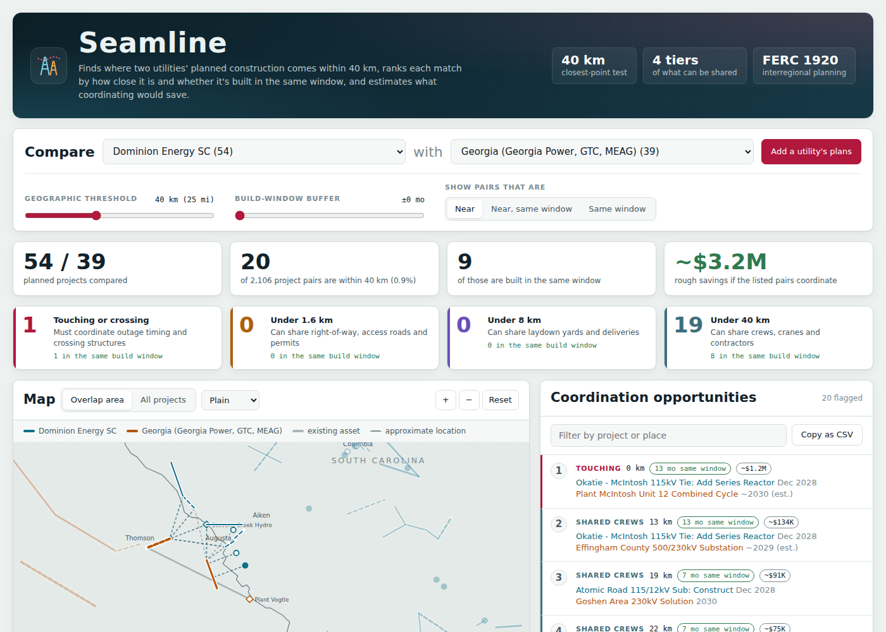
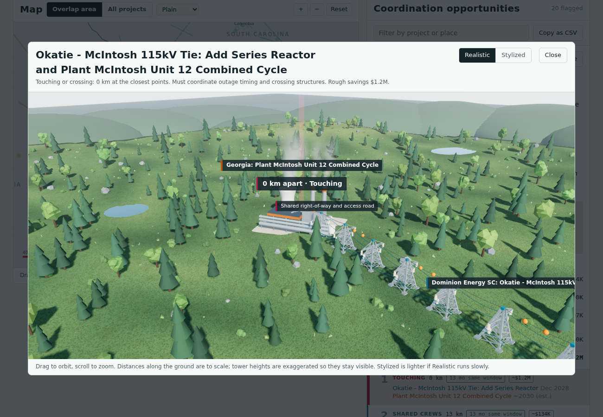
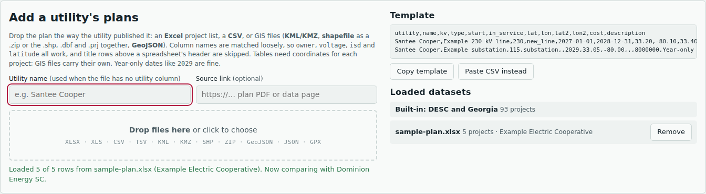

# Seamline

Seamline compares the planned transmission construction of two neighboring utilities and flags where their work overlaps, so they can share crews, equipment, land and outages.

The built-in example compares **Dominion Energy South Carolina** with **Georgia** (Georgia Power, Georgia Transmission and MEAG) along the Savannah River. You can load any other utility's plan from the files utilities actually publish: Excel project lists, CSV, KML/KMZ, shapefiles and GeoJSON.



A plain-language walkthrough of every screen, with screenshots, is in [`docs/Seamline-Field-Guide.docx`](docs/Seamline-Field-Guide.docx).

## Quick start

Open `index.html` in a browser. That's it: everything it needs is in this folder.

To serve it locally instead (some browsers limit local files):

```
npm start            # python3 -m http.server 8000, then open http://localhost:8000
```

## Interface

One screen, laid out like the coordination tools planners already use (Esri Capital Project Coordination, one.network): a map, the ranked overlaps beside it, and the build windows underneath, all linked.

- **Map** (MapLibre GL): Plain (works offline), Light, Satellite and Topo basemaps. **3D** tilts the same map over real terrain (Terrarium elevation tiles from USGS 3DEP data) and raises a tower every ~450 m along each planned line, so a pair can be seen where it really is, across the Savannah River. Line width is voltage, dashed is an approximate location, faded is a date that has passed, rings mark how close a pair is.
- **Overlaps**: ranked by expected savings (or chance, or distance), with each pair's chance of sharing a build window, what it would save if the dates held, and filters for distance tier, build period (next 12 months, next 3 years) and dates already passed.
- **Pair panel**: both projects side by side (work, window, plan drift, cost, how each end point was located, source page), the chance and why, what they can share item by item, the shared yard, a schedule what-if, a coordination status and a printable brief.
- **Plan changes**: how far each utility's dates moved between its last two plans, and which shared windows the latest updates opened or closed.
- **Optimize**: the few date moves that most raise expected savings, with a joint schedule proposal to print.
- **Data checks**: the validation report from the data pipeline, each check with the records it caught, downloadable as JSON.
- **Ask**: an assistant that answers plain-language questions ("which overlaps near Augusta are most likely to happen?", "what changed in DESC's plan?") from the same data, and can fly the map to what it's talking about. It runs Claude (`claude-opus-5`, with server-side fallbacks) through the Anthropic TypeScript SDK in the browser, with nine tools that read Seamline's own data (`src/agent.js` runs the loop; the tools are in `src/app.js`). Since the site has no server, each viewer pastes their own Anthropic API key; it stays in that browser and is sent only to Anthropic's API.
- The three.js pair scene is kept as a "3D illustration" from the pair panel.

## Features

- **Overlap finder.** Measures the distance between the closest points of every pair of projects (lines, substations, plants), flags pairs within 40 km, and tiers them by what the utilities could share.
- **Ranked list.** Tier first, then pairs built in the same window, then distance. Filter by tier, search, and copy the list as CSV.
- **What each pair can share.** Every pair lists what its tier allows, in the challenge's words: outage timing and crossing structures (touching), right-of-way, access roads and permits (under 1.6 km), laydown yards and deliveries (under 8 km), and crews, cranes and contractors (under 40 km). Closer pairs get everything farther tiers allow; yard and crew sharing needs a shared build window.
- **Existing infrastructure.** Existing plants, the Stevens Creek hydro plant and existing lines are drawn in grey and can be switched off. Existing lines and substations downloaded from HIFLD (GeoJSON, shapefile or KML) load as a background layer from the import panel.
- **Cost for each shared item.** Every item a pair can share gets its own savings figure with the math shown, like "20 days × $6.5K/day × 50%". The pair's total is their sum.
- **Shared yard finder.** For every pair, and for groups of 3 or more projects from both utilities built at the same time, Seamline finds the single best staging-yard spot: the point with the least total distance to every work site (a geometric median), moved to an existing substation or plant when one is almost as good. The map shows the yard, its 40 km crew-drive ring and a spoke to each site, and the app reports net truck-miles, driver-hours and CO2 avoided (EPA diesel factor) alongside the dollars. Groups appear at the top of the list under Shared yards.
- **Cost assumptions.** Every unit cost behind those figures (easement $ per acre, access road $ per km, permit package, laydown yard, heavy-haul trip, crane day, mobilization and contractor percentages, and each side's share) is editable at the bottom of the page. Every pair, the totals and the brief recalculate at once, and the numbers are remembered on that device.
- **Motion.** Staggered load-in, numbers that count to new values, scroll reveals, tier filters that lift and sink, a map that glides to the selected pair or yard, and 3D and brief windows that lift open. Only transforms and opacity animate, and it all switches off under the system's reduced-motion setting.
- **Light and dark themes** that follow the system setting.
- **Map** with pan and zoom and four styles: Plain, Streets, Satellite and Terrain.
- **Timeline** of each flagged project's estimated construction window.
- **The Seam.** The Georgia and South Carolina border, the Savannah River both utilities build along, is drawn as a stitched seam on the map.
- **Play the build years.** A time scrubber steps the map month by month. Projects light up while they're under construction, and flagged pairs that are building at the same time spark.
- **What-if schedule shift.** For any pair, slide one project earlier or later and watch the shared window and savings update. Seamline suggests the smallest move that gives both builds a real shared window.
- **Coordination brief.** One click writes a one-page memo for a pair, addressed to both utilities' planners: where and when they meet, each item they can share with its savings and math, a locator map and next steps. Print it, save it as a PDF, or copy the text.
- **3D view** of any pair: lattice towers, conductors, substations, plants, crews and the shared right-of-way or yard its tier allows. Rendered realistically: physically based materials, a physical sky that lights the scene, soft shadows, bloom and filmic tone mapping. A Labels button hides the floating tags for a clean view. A Quality menu picks Standard, High (the default: sharper resolution, ambient occlusion and SMAA) or Ultra (full screen resolution).
- **Import** any utility's plan and compare any two utilities, or set the second utility to **None** to just browse one utility's projects.



## How overlap is defined

- **Geographic (primary).** Two projects overlap if the closest points between them are within 40 km. The measurement uses the lines and points themselves, not their centers. Each overlap gets a tier:
  - Touching or crossing: must coordinate outage timing and crossing structures
  - Under 1.6 km: can share right-of-way, access roads and permits
  - Under 8 km: can share laydown yards and deliveries
  - Under 40 km: can share crews, cranes and contractors
- **Timeline (secondary).** Two projects are in the same build window if their construction periods overlap, plus an optional buffer. Plans usually list only an in-service date, so the start date is estimated from project type, voltage and length unless the file provides one.
- **Cost and impact.** Each shareable item the tier allows gets its own planning estimate, and yard, delivery, crew, crane and contractor items count only when the builds share a window. When one side's cost can be shared, each utility saves its share (50% by default); a coordinated outage and a crossing designed once count in full. The defaults are in `ASSUMPTIONS` in `src/engine.js` and can be changed in the app. They are round planning numbers, not quotes: compare them with USDA NASS Land Values, the MISO Transmission Cost Estimation Guide, and local crane and heavy-haul rates.

## Loading a utility's plans

Click **Add a utility's plans** and drop one or more files, or paste CSV rows.

| format | typical source | notes |
|---|---|---|
| Excel `.xlsx`, `.xlsm`, `.xls`, `.ods` | RTO and regional plan project lists (SERTP, MISO MTEP, PJM RTEP) | Every sheet is read. Title and note rows above the header are skipped. |
| CSV, TSV | Data portals, spreadsheet exports | Comma or tab separated. |
| KML, KMZ | Google Earth exports, utility project maps | Attributes come from ExtendedData or from the HTML table ArcGIS puts in each description. |
| Shapefile | GIS departments, HIFLD | Drop the `.zip`, or pick the `.shp`, `.dbf` and `.prj` together. Coordinates are reprojected to latitude and longitude using the `.prj`. |
| GeoJSON, JSON | Web maps, APIs | Point, LineString, MultiLineString, Polygon, MultiPolygon and GeometryCollection. |
| GPX | GPS field surveys | Tracks and waypoints. |

Column names are matched loosely. For example, `owner` or `Transmission Owner` works for utility, `Voltage (kV)` for kV, `ISD` or `Expected In-Service` for the in-service date, and `latitude` for lat. Shapefile field names cut to 10 characters, like `IN_SERVICE`, work too. The full list is `ALIASES` in `src/ingest.js`.

| field | required | notes |
|---|---|---|
| name | yes | project name |
| utility | no | taken from a utility column, the name typed in the import panel, or the file name, in that order |
| location | yes | `lat, lon` for a substation; add `lat2, lon2` for a line. GIS files carry their own geometry. |
| in_service | yes | `2029`, `2029-06`, `6/1/2029` or `Summer 2029`. Files without dates, like GPX, use the default in-service date typed in the import panel |
| kv, type, start, cost, description | no | type is `new_line`, `rebuild`, `substation` or `generation`, and is guessed from the name if left out |

The [`samples/`](samples) folder has one fictional plan per format (nine files) plus an example existing-lines layer, each from a different made-up utility, with projects placed near the built-in DESC and Georgia work so overlaps show up:

| file | utility | what it exercises |
|---|---|---|
| `lowcountry-power.csv` | Lowcountry Power Cooperative | the template's column names; a line that crosses Jasper–Okatie |
| `aiken-edgefield-electric.tsv` | Aiken-Edgefield Electric Cooperative | other column names (`Owner`, `ISD`, `To Lat`), `$6.5M` costs, `Summer 2027` dates |
| `ogeechee-transmission.json` | Ogeechee Transmission Cooperative | a JSON array with a `coords` list per project |
| `coastal-georgia-power.geojson` | Coastal Georgia Power Authority | LineString, Point, Polygon and MultiLineString |
| `midlands-rural-electric.xlsx` | Midlands Rural Electric | title rows, two sheets, real date cells, one row with no in-service date (reported as skipped) |
| `savannah-river-transmission.kml` | Savannah River Transmission Co. | attributes in an ArcGIS-style HTML table in each description |
| `piedmont-lakes-electric.kmz` | Piedmont Lakes Electric | zipped KML with ExtendedData and a MultiGeometry |
| `tri-county-grid-shapefile.zip` | Tri-County Grid Cooperative | two layers in UTM zone 17N, reprojected using the `.prj` |
| `hifld-style-existing-lines.geojson` | (existing lines, example) | the HIFLD field layout (`OWNER`, `VOLTAGE`, `SUB_1`, `SUB_2`); tick "These are existing lines" to load it as a background layer |
| `edisto-electric-survey.gpx` | Edisto Electric Cooperative | a surveyed route and waypoints with no dates or utility: type the utility name and a default in-service date first |

`tests/samples.test.js` loads each one through the same readers the browser uses. After an import, Seamline compares the new utility with whichever loaded utility has the nearest project.

Most published plan lists name substations but give no coordinates, and PDF-only plans need their table copied into Excel first. Adding coordinates is the one manual step.



## Project layout

```
index.html              the built app; open or deploy this (generated, don't edit)
src/
  index.html            page markup with placeholders the build fills in
  styles.css            styling, light and dark themes
  engine.js             core logic, no UI: distances, tiers, build windows, cost model, ranking
  ingest.js             turns rows or GeoJSON into projects: column aliases, dates, types, header detection
  formats.js            file readers: Excel, KML/KMZ/GPX, shapefiles, zips
  libs.js               loads third-party libraries on first use from vendor/, with a CDN fallback
  scene3d.js            the 3D pair illustration (three.js)
  map.js                the MapLibre map: basemaps, layers, 3D terrain and towers
  agent.js              the assistant's Claude tool-use loop (Anthropic SDK, loaded in the browser)
  app.js                the UI: overlaps, pair panel, plan changes, optimizer, data checks, timeline, import
data/
  projects.json         built-in DESC and Georgia projects (generated by scripts/build_projects.py)
  official/             the challenge's project lists as CSV, the OpenStreetMap extract, the reference overlaps and the unplaced list
  basemap.json          US state outlines and GA/SC counties
scripts/
  build.py              inlines src/ and data/ into index.html
  build_projects.py     the built-in project list, with sources and hand-placed coordinates, merged with the official lists
  extract_official.py   reads the challenge's DESC and Georgia Power PDFs into data/official/*.csv (needs pypdf)
  locate_official.py    places official projects from OpenStreetMap substations, with hand-checked overrides
samples/                sample plans in every supported format
tests/                  engine, importer and sample-file tests
vendor/                 pinned copies of d3, three.js, SheetJS, togeojson, JSZip and shpjs (see vendor/README.md)
docs/screenshots/       images used in this README
```

## Development

Requires Python 3 and Node 18 or newer.

```
npm install              # installs the linter and test helpers; the app itself has no dependencies to install
npm run build            # rebuild index.html after changing src/ or data/
npm run build:data       # also regenerate data/projects.json from scripts/build_projects.py
npm test                 # engine, importer and sample-file tests
npm run lint             # ESLint
npm run check            # lint, test, and confirm index.html is up to date
```

CI runs lint, tests and the index.html check on every push and pull request (`.github/workflows/ci.yml`).

## Deploying

Seamline is a static site: `index.html` plus the `vendor/` folder. Any static host works, and there is no build step to run on the host because `index.html` is committed already built.

- **GitHub Pages:** in the repository's Settings, open Pages, set Source to "Deploy from a branch", pick `main` and `/ (root)`, and save. The site appears at `https://<user>.github.io/<repo>/`. On a free GitHub plan the repository has to be public for Pages to work.
- **Netlify, Vercel, Cloudflare Pages or S3:** publish the repository root.

Satellite, Streets and Terrain map tiles come from Esri and OpenStreetMap and need an internet connection. The Plain map, the 3D view and every importer work offline.

## Official challenge data

The built-in dataset includes both project lists from the challenge package, not just the lists we found ourselves:

- **Georgia Power 2025 IRP, Volume 3 (Table 2, Georgia ITS Ten-Year Plan 2025-2034):** 218 projects from Georgia Power, GTC, MEAG and Dalton Utilities, with planning zone, TEAMS number, need date, and from each project's detail page the published start date, description and line miles.
- **DESC 2024-2028 $2M and above project descriptions:** 44 projects with in-service dates and costs.

`scripts/extract_official.py` reads the two PDFs into `data/official/*.csv`. `scripts/locate_official.py` places each project the way the challenge's *Finding Real Project Locations* guide describes: it splits the name into its end points, matches each one to a named substation or plant from OpenStreetMap (Overpass API, cached in `data/official/osm_places.json`), prefers the utility's own state and the copy nearest the project's planning zone, and throws out matches that are too far from the zone or give a line far longer than the plan says. Places confirmed by hand, and the coordinates in the challenge's reference table, override OpenStreetMap. Every project records how each end point was placed (`located`), and its location confidence sets how it is drawn. `python3 scripts/locate_official.py` prints and saves (`data/official/locations.csv`) that report for spot checks.

A project that appears in both an official list and our newer lists (SCRTP 2026-2030, SERTP 2026) keeps the newer entry and carries the official record in `official`. Of the 262 official projects, 62 were already on the map and 132 are added. The 68 that could not be placed (mostly Atlanta-area, south Georgia and customer substations that OpenStreetMap does not name) are listed in `data/official/unplaced.json`; none of them are in Georgia's Augusta or Savannah planning zones (215 and 219), which face South Carolina.

**Checked against the challenge's reference table.** `data/official/reference_overlaps.csv` holds the six overlaps in the challenge's `Projects_Overlaps.xlsx`. A test confirms Seamline flags all six. Seamline's distances are shorter than the reference's because it measures between the closest points of the two projects, as the challenge specifies, while the reference measures between their centres:

| reference | pair | reference (centre to centre) | Seamline (closest points) |
|---|---|---|---|
| OVL_1 | Hooks - Thurmond Tie / Evans Primary - Thurmond Dam #5 | 6.6 km | 0 km, touching (both end at Thurmond) |
| OVL_2 | Jasper - Okatie #2 / McIntosh - Purrysburg reactors | 9.1 km | 3.3 km |
| OVL_3 | Jasper - Okatie #2 / Goshen - McIntosh rebuild | 12.2 km | 4.8 km |
| OVL_4 | Stevens Creek - Hooks / Evans Primary - Thurmond Dam #5 | 12.9 km | 3.3 km |
| OVL_5 | Okatie - Bluffton / McIntosh - Purrysburg reactors | 23.1 km | 8.1 km |
| OVL_6 | Okatie - Bluffton / Goshen - McIntosh rebuild | 23.8 km | 13.5 km |

With everything loaded, DESC (64 projects) against Georgia (161) is 10,304 pairs, of which 169 (1.6%) are within 40 km, all of them along the Savannah River between Savannah and Lake Thurmond.

## Schedule risk and plan drift

Planned dates move, so an overlap on paper is not an overlap in the field. Seamline measures how much they move, from the plans themselves:

- **DESC:** 30 projects appear in both the 2024-2028 and the 2026-2030 lists. 23 of them moved later (median 12 months, up to 55); none moved earlier.
- **Georgia:** each IRP project page says how it changed from the previous ten-year plan. Of 94 projects with a history, 66 kept their date, 16 moved later and 12 earlier (up to 3 years either way).

`data/model.json` holds these month counts. For each flagged pair, `Engine.overlapChance` draws 2,000 times a month count for each project from its utility's list, moves both projects' windows by it, and counts how often they still share a window from today on (a window that has already closed cannot be shared). The draws are seeded from the pair, so the answer is the same every time. A project that is listed for a date that has passed and is gone from DESC's newer list is treated as likely built: no window left and nothing left to share. `Engine.expectedSavings` counts the items that need both crews in the field together (yards, deliveries, crews, cranes, contractors) by that chance, and outage, crossing, right-of-way, access-road and permit items in full.

What it shows on the built-in data:

- Of the 41 pairs that share a window on paper, 23 have less than a 50% chance of still sharing one, mostly because their shared months are already behind us. Reference overlap OVL_2 (Jasper - Okatie #2 / McIntosh - Purrysburg reactors) drops to 12%.
- 13 pairs that do not share a window on paper have a 50% or better chance of sharing one, because DESC's dates usually move later. Example: Jasper - Okatie #2 and the McIntosh Unit 12 combined cycle, 4.3 km apart, 68%.
- `Engine.driftChanges` replays each pair with the dates the previous plan listed. The latest updates opened 9 shared windows and closed 3. Reference overlap OVL_3 shares a window only because Jasper - Okatie #2 moved 11 months later.

`Engine.optimizeSchedule` then asks which few date moves would raise the pairs' total expected savings the most. Each round it tries moving every project that has not started (and is not likely built or a power plant) by 3 or 6 months either way, never starting before today, keeps the single most valuable move, and stops when no move is worth $25K. On the built-in data, 8 moves of at most 6 months raise expected savings from about $13.7M to $16.2M. Most of them bring a Georgia project earlier, toward where DESC's usually late dates are likely to land.

The model assumes each project moves once more, by an amount like the moves already seen, and that the two utilities' moves are independent. It is a planning aid, not a forecast.

## Validation report

`scripts/build_projects.py` writes a list of checks into `data/model.json` every time the data is rebuilt: every row of both PDFs read, detail pages matched, start dates before need dates, TEAMS numbers unique, projects in two plans counted once, OpenStreetMap namesakes rejected, line end points consistent with the plan's line length, projects not placed, in-service dates already passed and plan-change notes not understood. Each check lists the records it caught.

## Data sources and caveats

- DESC: [SCRTP 2026–2030 project descriptions ($2M and above)](https://www.scrtp.com/assets/pdfs/home/2026-2030-2million-and-above-project-descriptions.pdf). This list includes costs and exact dates.
- Georgia: [SERTP 2026 preliminary expansion plan](https://www.southeasternrtp.com/docs/general/2026/2026_SERTP_2nd_Qtr_Presentation.pdf), [2025 SERTP report](https://www.southeasternrtp.com/docs/general/2025/2025%20SERTP%20Preliminary%20Expansion%20Plan%20Report%20(Non-CEII).pdf), and Georgia Power's project pages for Callaway Road–Thomson and Effingham County. These give year-only dates and no costs.
- Public plans name substations but give no coordinates, so the built-in locations are placed by hand. `loc: "low"` marks best guesses, which are drawn dashed on the map. Spot-check project rows against the source PDFs.
- The Thomson–Vogtle 500 kV line has been in service since 2018. It appears as an existing asset for reference, along with DESC's Stevens Creek hydro plant in Martinez, Georgia.
- The files in `samples/` are fictional.
